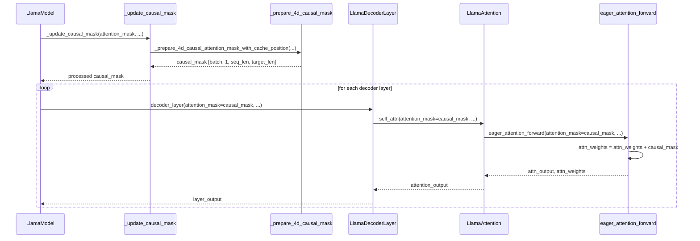

# LLaMA原始模型中Causal Mask的完整分析报告

## 🎯 概述

这个分析报告全面梳理了`original_model.py`中causal mask的使用情况，包括其工程实现、传递调用机制以及防止信息泄漏的具体原理。

## 📋 Causal Mask层次结构

### 1. **核心概念层面**
```python
# 第252行：标识Attention模块具有因果性
self.is_causal = True
```
这是一个标识符，告诉系统这个attention需要因果遮罩。

### 2. **数据流层面**
整个causal mask的数据流遵循以下路径：
```
LlamaModel.forward() 
    └── _update_causal_mask() 
        └── _prepare_4d_causal_attention_mask_with_cache_position()
            └── eager_attention_forward()
                └── 应用到attention weights
```

## 🔧 具体工程实现

### 1. **主入口：LlamaModel.forward()**

**位置**: 第568-569行
```python
causal_mask = self._update_causal_mask(
    attention_mask, inputs_embeds, cache_position, past_key_values, output_attentions
)
```

**作用**: 
- 作为模型前向传播的主入口点
- 统一处理所有类型的attention mask
- 为所有层提供统一的causal mask

**传递路径**:
```python
# 传递给每个decoder layer (第589行和第600行)
layer_outputs = decoder_layer(
    hidden_states,
    attention_mask=causal_mask,  # ← 核心传递点
    position_ids=position_ids,
    past_key_value=past_key_values,
    # ...其他参数
)
```

### 2. **核心处理器：_update_causal_mask()**

**位置**: 第628-696行

**功能**: 这是causal mask处理的核心函数，根据不同的attention实现方式分别处理：

#### A. Flash Attention 2处理
```python
if self.config._attn_implementation == "flash_attention_2":
    if attention_mask is not None and (attention_mask == 0.0).any():
        return attention_mask  # 直接返回用户提供的mask
    return None  # Flash Attention 2内置causal支持
```

#### B. Flex Attention处理
```python
if self.config._attn_implementation == "flex_attention":
    if isinstance(attention_mask, torch.Tensor):
        attention_mask = make_flex_block_causal_mask(attention_mask)
    return attention_mask
```

#### C. SDPA (Scaled Dot Product Attention) 优化
```python
if self.config._attn_implementation == "sdpa" and not using_static_cache and not output_attentions:
    if AttentionMaskConverter._ignore_causal_mask_sdpa(...):
        return None  # SDPA可以使用is_causal参数，不需要显式mask
```

#### D. 通用Eager实现
对于需要显式mask的情况，调用`_prepare_4d_causal_attention_mask_with_cache_position()`

### 3. **Mask生成器：_prepare_4d_causal_attention_mask_with_cache_position()**

**位置**: 第699-757行

**核心算法**:
```python
# 1. 创建基础的causal mask矩阵
min_dtype = torch.finfo(dtype).min  # 最小浮点值，表示-∞
causal_mask = torch.full(
    (sequence_length, target_length), 
    fill_value=min_dtype, 
    dtype=dtype, 
    device=device
)

# 2. 应用上三角遮罩 (核心的causal逻辑)
if sequence_length != 1:
    causal_mask = torch.triu(causal_mask, diagonal=1)

# 3. 应用缓存位置遮罩 (处理KV缓存场景)
causal_mask *= torch.arange(target_length, device=device) > cache_position.reshape(-1, 1)

# 4. 扩展到4D张量 [batch_size, 1, seq_len, target_len]
causal_mask = causal_mask[None, None, :, :].expand(batch_size, 1, -1, -1)

# 5. 应用padding mask (处理变长序列)
if attention_mask is not None:
    # 合并causal mask和padding mask
    padding_mask = causal_mask[:, :, :, :mask_length] + attention_mask[:, None, None, :].to(causal_mask.device)
    padding_mask = padding_mask == 0
    causal_mask[:, :, :, :mask_length] = causal_mask[:, :, :, :mask_length].masked_fill(padding_mask, min_dtype)
```

**关键理解**:
- `torch.triu(causal_mask, diagonal=1)`: 创建上三角矩阵，上三角部分为-∞，下三角部分为0
- 这确保了位置i只能看到位置0到i-1的信息，不能看到i+1及以后的信息

### 4. **最终应用：eager_attention_forward()**

**位置**: 第230-231行
```python
if attention_mask is not None:
    causal_mask = attention_mask[:, :, :, : key_states.shape[-2]]  # 裁剪到合适长度
    attn_weights = attn_weights + causal_mask  # 直接加到attention weights上
```

**机制解释**:
- `attn_weights`: 原始的QK^T结果，形状为[batch, heads, seq_len, seq_len]
- `causal_mask`: 下三角为0，上三角为-∞的mask
- 相加后: 下三角保持原值，上三角变为-∞
- 经过softmax后: 下三角得到正常权重，上三角权重为0

## 🛡️ 信息泄漏防护机制

### 1. **时间维度的因果性**
```
位置0: 只能看到 token[0]
位置1: 只能看到 token[0], token[1] 
位置2: 只能看到 token[0], token[1], token[2]
...
位置i: 只能看到 token[0] 到 token[i]
```

### 2. **数学实现**
通过在attention weights中添加-∞来实现：
```
原始 attention_weights: [[a00, a01, a02],
                         [a10, a11, a12], 
                         [a20, a21, a22]]

加上 causal_mask:      [[  0, -∞, -∞],
                        [  0,  0, -∞],
                        [  0,  0,  0]]

结果:                   [[a00, -∞, -∞],
                        [a10, a11, -∞],
                        [a20, a21, a22]]

经过 softmax:           [[1.0, 0.0, 0.0],
                        [w10, w11, 0.0],
                        [w20, w21, w22]]
```

### 3. **多种场景的处理**

#### A. 正常训练场景
- 完整的4D causal mask
- 确保严格的从左到右的信息流

#### B. 推理场景（KV缓存）
- 使用`cache_position`处理增量生成
- 只对新token应用causal约束

#### C. 变长序列场景
- 结合padding mask和causal mask
- 确保padding位置不参与attention

#### D. 特殊优化场景
- Flash Attention 2: 内置causal支持
- SDPA: 使用`is_causal=True`参数代替显式mask

## 📊 调用时序图



## 🔍 关键设计特点

### 1. **分层设计**
- **策略层**: `_update_causal_mask()` 决定使用哪种mask策略
- **生成层**: `_prepare_4d_causal_attention_mask_with_cache_position()` 生成具体mask
- **应用层**: `eager_attention_forward()` 将mask应用到attention计算

### 2. **性能优化**
- **条件跳过**: 对于Flash Attention等，直接跳过显式mask生成
- **内存优化**: 使用in-place操作和contiguous memory
- **设备优化**: 特殊处理CUDA/XPU设备上的SDPA

### 3. **兼容性处理**
- **多种attention实现**: eager, sdpa, flash_attention_2, flex_attention
- **缓存系统**: 支持DynamicCache和StaticCache
- **训练/推理**: 不同模式下的优化策略

## ⚠️ 潜在风险点

### 1. **Cache Position处理**
```python
causal_mask *= torch.arange(target_length, device=device) > cache_position.reshape(-1, 1)
```
如果`cache_position`计算错误，可能导致信息泄漏。

### 2. **Mask合并逻辑**
```python
padding_mask = causal_mask[:, :, :, :mask_length] + attention_mask[:, None, None, :].to(causal_mask.device)
```
Padding mask和causal mask的合并需要确保正确性。

### 3. **数值稳定性**
使用`torch.finfo(dtype).min`作为-∞可能在某些情况下导致数值问题。

## 🎯 总结

这个实现提供了**多层次、多策略的causal mask系统**：

1. **完备性**: 覆盖了所有主要的attention实现方式
2. **性能**: 针对不同场景进行了优化
3. **安全性**: 通过严格的上三角遮罩确保因果性
4. **灵活性**: 支持各种缓存和推理场景

这套causal mask系统是防止信息泄漏的核心机制，确保了Transformer模型的自回归特性和因果约束。
