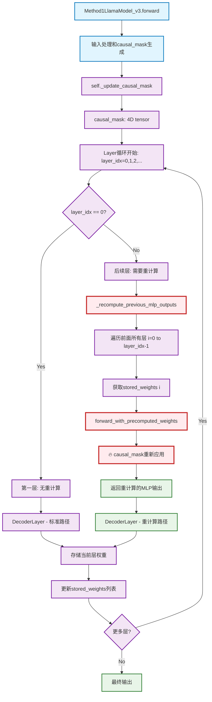

# Method1
Attention处残差连接与原始模型相同。修改MLP处的残差为先前层重算的MLP输出累加。先前层MLP输出的重算方法为：
* 保留第一次Attention计算的attn_weights，$W^V$.weight$，$W^O$.weight，仅更换输入嵌入矩阵X
* 输入嵌入X做input_norm
* Attention重算
* Attention残差连接
* post_attn_layernorm
* MLP计算
* MLP计算结果不做残差连接直接输出，作为重算后的MLP输出

# Method2
MLP处残差连接与原始模型相同。修改Attention处的残差为先前层重算的Attention输出累加。先前层Attention输出的重算方法为：
* 保留第一次Attention计算的attn_weights，$W^V$.weight，$W^O$.weight，仅更换输入嵌入矩阵X
* 输入嵌入X做input_norm
* Attention重算
* Attention重算结果不做残差连接直接输出，作为重算后的Attention输出

即：Method1_v3与Method2_v3的差别为：残差连接的修改位点不同，先前层输出重算的截止位置不同（截至MLP输出/截至Attention输出）

# Method3
与Method1基本相同，唯一不同之处在于MLP处残差和进行了归一化，且每一层的权重分布为1/m(Method 3.1)或可学习权重(Method3.2)

# Method4
与Method2基本相同，唯一不同之处在于Attention处残差和进行了归一化，且每一层的权重分布为1/m(Method 4.1)或可学习权重(Method4.2)

# Method5（注：现为Version4的七种方法）
相当于PT扩充多组Z node。直接将注意力得分计算由$Softmax(\dfrac{QK^T}{\sqrt{d_k}})$改成$Softmax(\dfrac{\sum QK^T}{d_s})$（$d_s$待定），即只需要记录之前层的$QK^T$矩阵再直接相加

* Method5.1:$d_s=\sqrt{d_k}$
* Method5.2:$d_s=\sqrt{d_k}·\sqrt{m}$(m为层数)
* Method5.3:$d_s=\sqrt{d_k}·m$
* Method5.4:$d_s=d_k^a·m^b$(a,b为可学习参数)
* Method5.5:$d_s$为可学习的$\sqrt{d_k}*\vec{a}$向量，原先求和除以分母操作变为$QK^T$向量与$d_s$向量点乘

---

# Idea推导

由论文中公式(27)( $G^{(t-1)}=2\sum_c{Q_{h,c}^{(t-1)}V_cU^{(c)T}}$ )可知：多组H node对Z node更新的消息量为$G=2\sum_n \sum_c {Q_{h,c}^{(t-1)}V_{n.c}U^{(c)T}}$。其中n为H node的组别，$V_c=Q_z^{(t-1)}V^{(c)}$

其中：$V_c$的信息来源于上一轮的$Q_z$而非更新该组时的轮次（类比Transformer中的第i层）。所以相当于Transformers中注意力模块的$V$需要重算。

由$V_c=Q_z^{(t-1)}V^{(c)}$可知：$V^{(c)}$没有发生改变，相当于Transformer层中的$W^V$没有发生改变，仅有输入嵌入$X$发生改变，即PT中的$Q_Z$轮次不再是当时的轮次。所以重算$V$的方法为：每层都重算，输入嵌入$X$改成当前Transformer层的$X$。

# 工程实现

### LlamaForCausalLM->Method1LlamaForCausalLM_v3
唯一的改动在于self.model变为自定义model

### LlamaModel->Method1LlamaModel_v3

**一、添加def _recompute_previous_mlp_outputs，用于重算之前层的MLP输出：**
* 接受存取的当前层输入嵌入X、之前层存取的注意力权重矩阵($Softmax(\dfrac{QK^T}{\sqrt{d_k}})$)、$W^V$、MLP与normalization计算模块等信息
* 逐层循环
  * 调用forward_with_precomputed_weights函数（定义在class Method1LlamaAttention_v3中），直接利用存取的attn_weights、$W^V$等与输入嵌入X进行注意力运算，并加上causal mask（301 304行）
  * 直接利用存取的mlp模块做MLP运算
  * 存储该层重算后的MLP输出
* 返回重算后的MLP输出列表recomputed_mlp_outputs

**二、forward函数修改**
* 用stored_weights(379行)存取先前层的注意力权重矩阵和$W^V$，用于向_recompute_previous_mlp_outputs传参
* _recompute_previous_mlp_outputs计算的recomputed_mlp_outputs，向DecoderLayer传参，作为先前层的残差，更新MLP的残差连接

### LlamaDecoderLayer->Method1DecoderLayer_v3

**一、attention模块修改**
* self.self_attn改为自定义的attention实现模块Method1LlamaAttention_v3

**二、forward函数修改**
* 调用新的自定义self_attn模块
* self_attn期望返回attn_output，attn_weights（$Softmax(\dfrac{QK^T}{\sqrt{d_k}})$），present_key_value，stored_attn_weights（与attn_weights完全相同，此处写重复了），v_proj_weight（$W^V$），将缓存的attn_weights、$W^V$与self.mlp\存储至字典current_weights当中
* Attention部分残差连接遵循原模型，MLP部分残差改为重算过的previous_mlp_outputs（由修改后的LlamaModel传参而来）求和
* 返回值为：Decoderlayer最终输出+self_attn_weights+present_key_value+字典current_weights。相比原始的DecoderLayer输出多了一个字典current_weights

### LlamaAttention->Method1LlamaAttention_v3

**一、forward函数修改**
* 首先调用父类forward方法，得到attn_output, attn_weights, past_key_value合并为attention_result
* 返回：attn_output, attn_weights, past_key_value,attn_weights,self.v_proj.weight。相比原始的attention返回值，多了attn_weights,self.v_proj.weight（$Softmax(\dfrac{QK^T}{\sqrt{d_k}})$和$W^V$）

**二、forward_with_precomputed_weights函数**
* 利用新的输入嵌入X，重算V矩阵
* 对attn_weights（$Softmax(\dfrac{QK^T}{\sqrt{d_k}})$）应用causal mask
* 重算注意力输出

# Problems

目前训练仍存在过拟合情况（loss趋近于0，accuracy趋近于1）

### Causal Mask传递路径分析

* 在Method1LlamaNodel_v3中由self._update_causal_mask生成（369行）
  * 每层循环时，将causal mask传参至_recompute_previous_mlp_outputs，参与先前层mlp输出的重算
    * _recompute_previous_mlp_outputs中，传参至attention模块的forward_with_precomputed_weights，参与注意力权重的重算
  * 每层循环时，同样传参至decoder_layer，参与当前层输出的计算
    * 传参至self.self_attn模块，参与当前层注意力输出的计算

总结：attention mask分两路传递，分别传递至当前层注意力机制的计算和先前所有层mlp输出重算中的注意力重算模块

