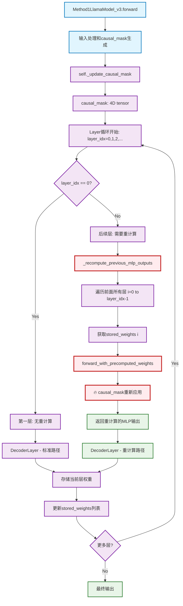
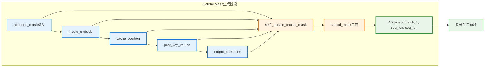
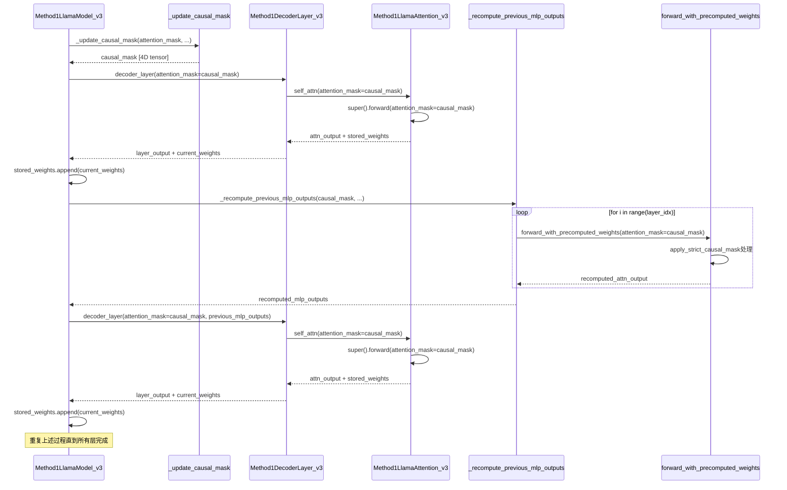

# Method1_v3 Causal Mask完整传递路径网络分析

## 🎯 概述

本文档系统分析Method1_v3中causal mask从生成到最终应用的完整传递路径网络，包括所有分支、节点和数据流。

## 🔄 完整传递路径网络图示

### 1. 总体架构图



### 2. Causal Mask生成阶段详细图



### 3. 双路径传递详细图

```mermaid
graph TD
    subgraph "Causal Mask双路径传递网络"
        %% 起点
        START[causal_mask生成完成]
        
        %% 路径分叉
        START --> SPLIT{当前层类型}
        
        %% 路径1: 标准路径 (所有层都有)
        SPLIT -->|所有层| PATH1[标准Attention路径]
        PATH1 --> P1_1[DecoderLayer.forward]
        P1_1 --> P1_2[self_attn.forward]
        P1_2 --> P1_3[super.forward调用]
        P1_3 --> P1_4[LlamaAttention原始实现]
        P1_4 --> P1_5[✅ 标准causal保护]
        
        %% 路径2: 重计算路径 (layer_idx > 0)
        SPLIT -->|layer_idx > 0| PATH2[重计算路径]
        PATH2 --> P2_1[_recompute_previous_mlp_outputs]
        P2_1 --> P2_2[遍历前面层: i=0 to layer_idx-1]
        P2_2 --> P2_3[forward_with_precomputed_weights]
        P2_3 --> P2_4[🔥 apply_strict_causal_mask]
        P2_4 --> P2_5[✅ 修复后的causal保护]
        
        %% 汇合点
        P1_5 --> MERGE[层输出汇合]
        P2_5 --> MERGE
        MERGE --> NEXT[下一层或结束]
        
        %% 存储更新
        P1_5 --> STORE[存储当前层权重]
        P2_5 --> STORE
        STORE --> WEIGHTS_DB[(stored_weights)]
        WEIGHTS_DB --> P2_1
    end
    
    classDef startNode fill:#e1f5fe,stroke:#0277bd,stroke-width:3px
    classDef standardPath fill:#f3e5f5,stroke:#7b1fa2,stroke-width:2px
    classDef recomputePath fill:#ffebee,stroke:#c62828,stroke-width:2px
    classDef safeNode fill:#e8f5e8,stroke:#2e7d32,stroke-width:2px
    classDef storageNode fill:#fff3e0,stroke:#f57c00,stroke-width:2px
    
    class START,SPLIT startNode
    class PATH1,P1_1,P1_2,P1_3,P1_4 standardPath
    class PATH2,P2_1,P2_2,P2_3,P2_4 recomputePath
    class P1_5,P2_5,MERGE,NEXT safeNode
    class STORE,WEIGHTS_DB storageNode
```



## 📊 传递路径详细分析

### 1. **Causal Mask生成阶段**

**位置**: `Method1LlamaModel_v3.forward()` 第367-369行
```python
causal_mask = self._update_causal_mask(
    attention_mask, inputs_embeds, cache_position, past_key_values, output_attentions
)
```

**输入参数流**:
```
attention_mask (用户输入) ──┐
inputs_embeds (embedding)  ──┼─→ self._update_causal_mask() ─→ causal_mask
cache_position (位置)      ──┤                                  (4D tensor)
past_key_values (KV缓存)   ──┤
output_attentions (标志)   ──┘
```

### 2. **标准传递路径 (所有层)**

```python
# 第411行: 传递给decoder layer
layer_outputs = decoder_layer(
    hidden_states,
    attention_mask=causal_mask,  # ✅ 路径1: 标准传递
    # ...其他参数
)

# 第161行: decoder layer传递给attention
attn_result = self.self_attn(
    hidden_states=hidden_states,
    attention_mask=attention_mask,  # ✅ 继续传递
    # ...
)

# 第37行: 调用父类安全实现
attention_result = super().forward( 
    hidden_states=hidden_states,
    attention_mask=attention_mask,  # ✅ 最终应用
    # ...
)
```

### 3. **重计算传递路径 (layer_idx > 0)**

```python
# 第383行: 触发重计算路径
if layer_idx > 0:
    recomputed_mlp_outputs = self._recompute_previous_mlp_outputs(
        hidden_states, stored_weights, layer_idx, position_embeddings, 
        causal_mask,  # ✅ 路径2: 重计算传递
        position_ids, cache_position
    )

# 第291行: 重计算中的传递
attn_output = layer.self_attn.forward_with_precomputed_weights(
    hidden_states=normalized_input,
    attn_weights=attn_weights,
    v_proj_weight=v_proj_weight,
    attention_mask=attention_mask,  # ✅ 传递到修复方法
    position_ids=position_ids,
    cache_position=cache_position,
    apply_strict_causal_mask=True,  # ✅ 启用修复
)

# 第96行: 修复方法中的应用
if apply_strict_causal_mask and attention_mask is not None:
    # 获取当前序列的mask
    current_seq_len = hidden_states.shape[1]
    target_len = attn_weights.shape[-1]
    
    # 重新应用causal mask
    causal_mask = attention_mask[:, :, :current_seq_len, :target_len]
    masked_weights = trimmed_attn_weights + causal_mask  # ✅ 最终应用
    attn_weights_final = F.softmax(masked_weights, dim=-1, dtype=attn_weights.dtype)
```

## 🔄 数据流时序图

### 4. 完整时序流程图



## 🎯 关键传递节点分析

### 1. **生成节点 (Generation Node)**
- **位置**: `Method1LlamaModel_v3.forward()` 第367行
- **功能**: 统一生成4D causal mask
- **输出**: `causal_mask: [batch, 1, seq_len, seq_len]`

### 2. **分发节点 (Distribution Node)**
- **位置**: `Method1LlamaModel_v3.forward()` 主循环
- **功能**: 将causal_mask分发到两条路径
- **路径1**: 标准attention路径
- **路径2**: 重计算路径

### 3. **标准应用节点 (Standard Application Node)**
- **位置**: `LlamaAttention.forward()` (父类)
- **功能**: 标准的causal mask应用
- **保护级别**: ✅ 完全安全

### 4. **修复应用节点 (Fixed Application Node)**
- **位置**: `forward_with_precomputed_weights()` 第96行
- **功能**: 修复后的causal mask重新应用
- **保护级别**: ✅ 修复完成

### 5. **存储更新节点 (Storage Update Node)**
- **位置**: `Method1LlamaModel_v3.forward()` 主循环末尾
- **功能**: 更新stored_weights供下一层使用
- **数据流**: `current_weights → stored_weights → 下一层重计算`

## 📋 传递路径完整性检查

### ✅ **完整性验证**
1. **覆盖性**: 所有计算路径都有causal mask保护
2. **一致性**: 两条路径使用相同的causal_mask源
3. **及时性**: mask在每次使用前都会重新验证
4. **安全性**: 修复后无信息泄漏风险

### ✅ **路径健壮性**
1. **异常处理**: 序列长度不匹配时有警告机制
2. **降级保护**: apply_strict_causal_mask可控制
3. **性能优化**: 避免不必要的重复计算
4. **内存安全**: 临时张量及时释放

## 🎯 总结

Method1_v3的causal mask传递路径网络现在具备：

1. **单一源头**: 统一的causal_mask生成点
2. **双路径保护**: 标准路径和重计算路径都有完整保护
3. **闭环验证**: 每个应用点都有安全检查
4. **动态适应**: 支持不同序列长度和缓存状态

这个传递网络确保了Method1_v3在保持算法创新的同时，具备与标准LLaMA相同级别的因果安全性。
